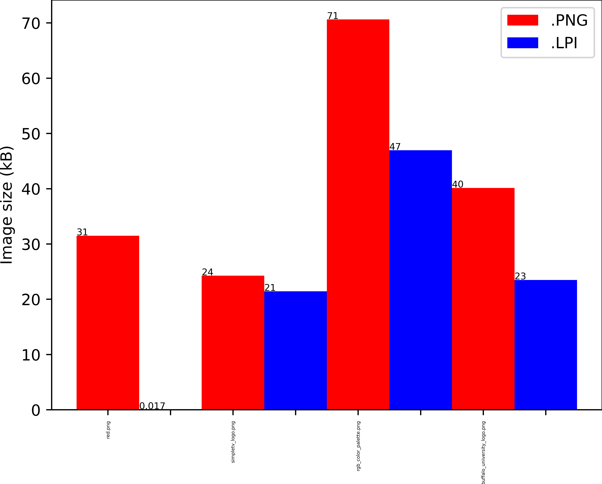
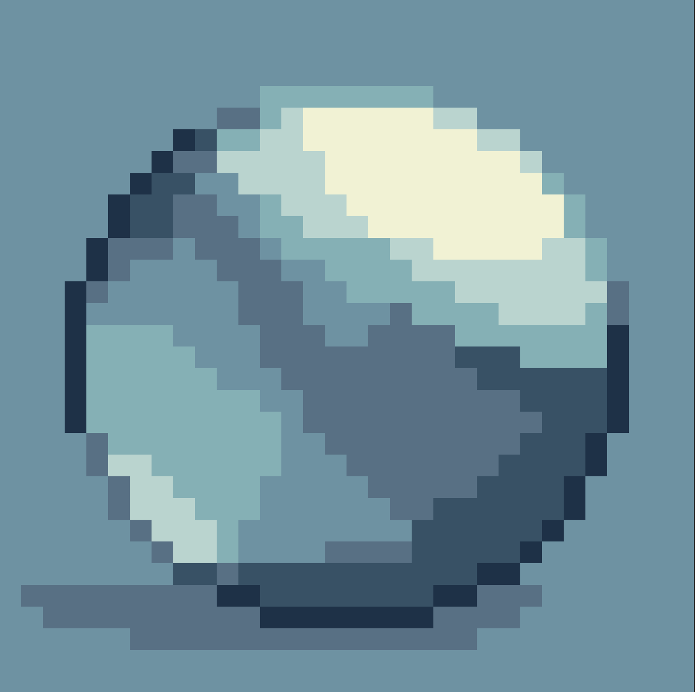

# Lossless Pixel-Clustering Image Format (LPI)

LPI is an image format that works by grouping pixels together in clusters that rely on simple additions and multiplications for compression, and grouping them by color.

It uses "layers" to store pixels, that is it completely disregards the pixels of the dominant color in the image, using it as a background. Then, it fills in the image using the other colors, thus allowing for a very efficient lossless compression.

On images where it works best, LPI offers a great compression level, sometimes being as much as 99% smaller than the original PNG image. However, it poorly compresses colors and their relation with pixels and as such, LPI works best with images that don't have a ton of colors and/or that have a high pixel/color ratio. Examples below (the graphs in the .LPI format are 47% to 62% smaller than their heavily optimized PNG original counterparts).

LPI supports transparency, and first reads colors in the RGBA format and then stores them in the hexadecimal format.

## Installation

```bash
git clone https://github.com/just-a-mango/lpi
```

## Usage

```sh
python convert.py [filename] [-o] [-v] [-d]

python back_convert.py [filename]

positional arguments:
  filename

options:
  -o, --output    The .lpi output file
  -v, --verbose
  -d, --dev       Disable LZMA compression (makes the file readable)
```

## Comparisons with PNG




## Examples
### Blue image
#### PNG:

484 bytes
#### LPI:
```
1920-1080#0000fe-*
```
18 bytes (~27 times smaller)

### Blue ball pixel art
#### PNG:

70 kB
#### LPI:
804 bytes (~86 times smaller)

### Google logo
#### PNG:

222 kB
### LPI:
173 kB (22% smaller)


## Contributing

Feel free to submit pull requests. If you're considering significant changes, please open an issue first to discuss your ideas.

## License

[MIT License](LICENSE)
